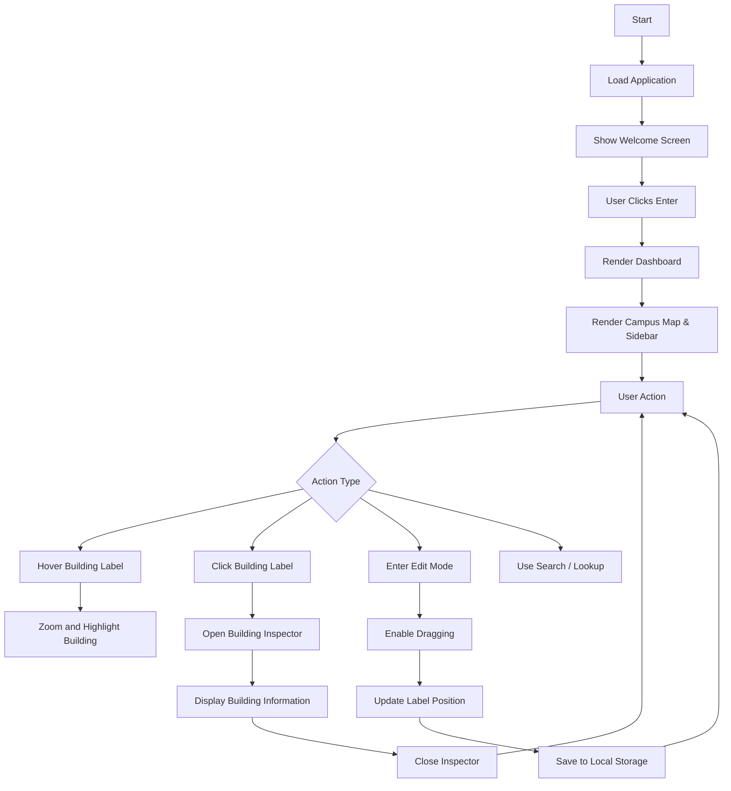
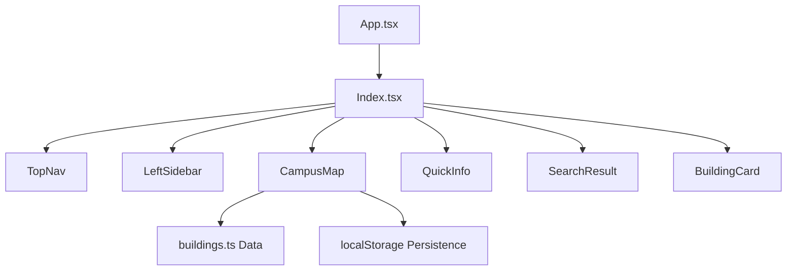
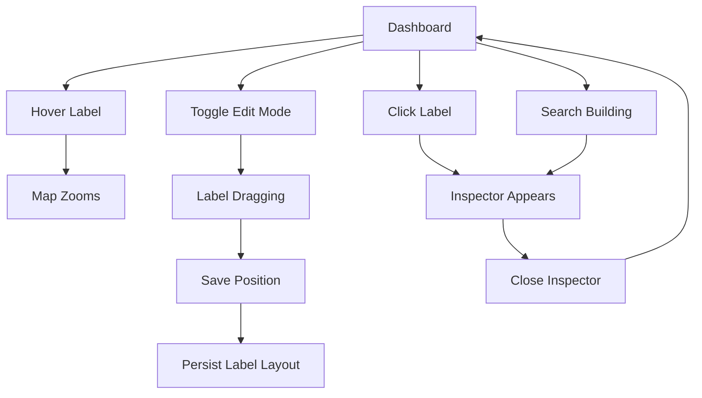

# Project Report: Laureate Campus Atlas

## Title Page

**Project Title:** Laureate Campus Atlas

**Submitted by:** [Your Name]

**Department:** Pharmacy

**Institution:** Laureate Institute of Pharmacy

**Course:** [Course Name]

**Academic Year:** 2025-2026

**Supervisor:** [Supervisor Name]

**Date:** April 2026

---

## Certificate

This is to certify that the project titled **"Laureate Campus Atlas"** is a genuine work carried out by me under the guidance of [Supervisor Name]. The report has not been submitted to any other institution for any degree or diploma.

**Signature:** ____________________

**Date:** ____________________

---

## Acknowledgements

I gratefully acknowledge the guidance, encouragement, and support of my project supervisor [Supervisor Name]. I also thank the faculty members and classmates who provided constructive feedback during the development of this application.

Special thanks to the developers and maintainers of React, Vite, Tailwind CSS, Framer Motion, Radix UI, and all open-source libraries used in this project. Their contributions helped ensure the project could be built rapidly and with a high degree of polish.

I would also like to express gratitude to the Laureate Institute of Pharmacy administration and staff for providing campus information, photographs, and permission to use the campus layout for this digital project.

---

## Abstract

The Laureate Campus Atlas project presents a modern digital campus navigation system for the Laureate Institute of Pharmacy. This project was conceived to replace static printed campus maps with an interactive, responsive, and visually engaging web experience.

The final application is a single-page frontend system built using React, TypeScript, Vite, Tailwind CSS, and Framer Motion. It features an immersive welcome screen, a campus map with interactive building labels, hover and click interactions, a building inspector card, and support for user-customized label positions.

This report documents the complete project lifecycle: requirements analysis, system design, implementation details, testing and validation, deployment, and future enhancements. The aim is to demonstrate how the application solves real navigation challenges and how it can be extended into a fully featured campus information platform.

---

## Table of Contents

1. Introduction
2. Problem Statement
3. Objectives
4. Scope
5. Literature Review
6. System Analysis
7. System Design
8. Implementation
9. Testing and Validation
10. Deployment
11. Results and Discussion
12. Conclusion
13. Future Work
14. References
15. Flowcharts
16. Appendices

---

## List of Figures and Tables

- Figure 1: Campus Map Interface
- Figure 2: Welcome Screen Flow
- Figure 3: Campus Map Interaction Flowchart
- Figure 4: Component Responsibility Diagram
- Table 1: Functional Requirements
- Table 2: Non-functional Requirements
- Table 3: Use Case Summary

---

## 1. Introduction

A campus navigation system is an essential tool for educational institutions, especially for new students, visitors, and event attendees. Traditional printed campus maps are often difficult to interpret, quickly become outdated, and provide only static information. A digital campus map offers a more dynamic alternative, making it easier to discover buildings, pathways, facilities, and the relationships between campus spaces.

The Laureate Campus Atlas project aims to create a polished online campus guide tailored to the Laureate Institute of Pharmacy. It includes an intuitive user interface, interactive building selection, and contextual detail panels that help users learn more about the campus quickly.

### 1.1 Background

The Laureate Institute of Pharmacy campus is home to multiple academic buildings, administrative offices, recreational facilities, and support services. As the campus expands and more students join the institute, the need for a modern navigation aid becomes increasingly important.

Most visitors currently rely on printed maps or verbal directions provided by staff. These methods are time-consuming and do not offer the ability to explore campus features before arrival. A digital campus atlas gives users the ability to familiarize themselves with the campus layout remotely and to make decisions about which buildings to visit.

### 1.2 Purpose of the Project

The primary purpose of this project is to develop a responsive and user-friendly campus atlas web application that addresses navigation challenges on campus. It should:

- allow users to locate campus buildings visually
- provide building details and photo previews
- support label repositioning for user personalization
- persist user preferences between sessions
- offer a clean and modern interface for campus exploration

### 1.3 Project Motivation

The motivation for creating the Laureate Campus Atlas stems from the desire to improve campus orientation and reduce the reliance on physical maps. By providing a digital interface, the project enhances convenience, improves accessibility, and introduces a contemporary online presence for campus navigation.

The project also serves as an academic demonstration of modern frontend engineering practices and interactive UI design.

---

## 2. Problem Statement

A well-designed campus navigation system should reduce confusion, support quick decision-making, and present the campus in a way that is easy to interpret. The current campus wayfinding solutions at many institutions, including the Laureate Institute of Pharmacy, are often fragmented and outdated.

### 2.1 Key Problems

The specific problems addressed by this project include:

- **Static maps**: printed campus maps and basic PDFs cannot adapt to user needs or show interactive information.
- **Poor discoverability**: users may not know which buildings contain the facilities they need.
- **Inefficient orientation**: visitors can spend additional time asking for directions or searching for locations.
- **Lack of detail**: static campus maps do not provide immediate access to building descriptions, images, or facility statistics.
- **No personalization**: users cannot easily adjust map labels or save their preferred view.

### 2.2 Target Users

The target users of the Laureate Campus Atlas are:

- new students who are unfamiliar with the campus layout
- visitors and guests attending events or meetings on campus
- faculty and staff who need quick access to building information
- administrative personnel who want an easy way to present campus facilities

### 2.3 Impact

Without an adaptable digital navigation system, users may experience frustration, delays, and orientation challenges when moving around campus. This can affect first impressions and reduce the efficiency of campus visits.

A digital campus atlas helps minimize these issues by offering a modern interface that is both visually clear and functionally powerful.

---

## 3. Objectives

### 3.1 Main Objective

To develop a modern, web-based campus atlas that enables interactive navigation and building discovery for the Laureate Institute of Pharmacy.

### 3.2 Specific Objectives

The project seeks to achieve the following measurable objectives:

- design and implement a responsive single-page application
- create interactive building hotspots on a detailed campus illustration
- develop an engaging welcome screen with media and animation
- implement a building inspector panel with descriptive content and images
- add hover zoom and highlight behavior for better map focus
- enable drag-and-drop label repositioning in edit mode
- persist label positions using browser local storage
- ensure the application performs well in major modern browsers
- document the entire system design, implementation, and testing process

### 3.3 Success Criteria

The project is considered successful when the following criteria are met:

- users can view and interact with the campus map
- building details can be accessed through click events
- label positions are saved between page loads
- the application remains stable and responsive
- the interface is accessible and visually engaging

---

## 4. Scope

### 4.1 In Scope

For this project, the scope covers the following:

- frontend web development using modern JavaScript tooling
- building an interactive campus map and dashboard layout
- creating reusable UI components for navigation and information display
- modeling campus buildings and metadata in a reusable data structure
- implementing local browser storage for saving user preferences
- documenting design, implementation, testing, and deployment

### 4.2 Out of Scope

The project intentionally excludes the following items:

- backend database or API implementation
- user authentication or account management
- real-time GPS routing or live location tracking
- voice-guided navigation
- offline map support

### 4.3 Assumptions

The project is developed with these assumptions in mind:

- the application will be used on modern desktop and laptop environments
- the campus data remains static for the current project phase
- users can access the internet when using the application
- the browser environment supports standard HTML5 and CSS3 features

### 4.4 Constraints

This project is constrained by the following factors:

- the absence of a backend server means the data must be bundled statically
- mobile support is focused on responsive layout rather than fully optimized mobile gestures
- the application is expected to operate within typical browser security restrictions

---

## 5. Literature Review

The literature review describes relevant research and design principles that informed the development of this project.

### 5.1 Campus Navigation Systems

Campus navigation systems come in several forms, including static brochures, interactive kiosks, mobile applications, and web portals. Research into campus navigation emphasizes the importance of clarity, context, and immediate access to information.

Many successful campus navigation solutions include search functions, building filters, and interactive maps. These systems are valued for helping users find classes, administrative services, and recreational facilities with minimal confusion.

### 5.2 UI/UX Considerations

The quality of a navigation interface depends heavily on user experience design. Key considerations include:

- visual hierarchy: important information should be obvious and easy to locate
- feedback: interactive elements must respond clearly to hover and click actions
- readability: text and labels must be legible across different screen sizes
- consistency: visual styling and interaction behavior should remain uniform
- accessibility: the interface should be usable by diverse users, including those with disabilities

### 5.3 Technology Benefits

The selected technology stack provides several advantages:

- React enables component reuse and declarative UI development
- TypeScript prevents many common programming errors during development
- Vite offers fast hot module replacement and optimized production builds
- Tailwind CSS reduces stylesheet complexity through utility classes
- Framer Motion adds natural motion without requiring low-level animation code
- Radix UI provides accessible building blocks for interactive components

These tools together support rapid development and long-term maintainability.

### 5.4 Comparative Solutions

Compared to traditional static campus maps, a digital solution offers dynamic interactions and the ability to persist user preferences. Compared to mobile-only solutions, a web-based app can be accessed from any modern browser without installation.

The Laureate Campus Atlas is designed to fit the specific campus context while using proven modern frontend patterns.

---

## 6. System Analysis

This section captures the detailed functional and non-functional requirements for the system.

### 6.1 Functional Requirements

The system is required to support the following functions:

- display an introductory welcome screen
- present an interactive campus map
- highlight buildings on hover
- allow building selection via click
- show building details in an inspector panel
- enable label editing and repositioning
- save custom label positions locally
- present a responsive layout for large screens

### 6.2 Non-functional Requirements

The system must also satisfy these non-functional requirements:

- performance: the app should load quickly and respond smoothly
- maintainability: the code should be clean, modular, and well-structured
- reliability: the application should not crash during normal use
- usability: the interface should be intuitive for first-time users
- accessibility: UI elements should be accessible to users with disabilities

### 6.3 Use Case Summary

| Use Case | Actor | Description |
|---|---|---|
| Launch App | Visitor | user opens the application and sees the welcome screen |
| Enter Campus | Visitor | user clicks the enter button to see the dashboard |
| Hover Building | Visitor | user moves the cursor over a building label and the map highlights the area |
| View Building Details | Visitor | user clicks a building label to open the inspector card |
| Edit Labels | Visitor | user toggles edit mode and moves labels to new positions |
| Save Layout | Visitor | label positions are saved automatically in local storage |

### 6.4 Environmental Constraints

The application is expected to run in modern browsers such as Chrome, Edge, and Firefox. It is not designed for legacy browsers or outdated devices.

Local storage is used for persistence, so the application assumes that the browser supports the Web Storage API.

### 6.5 Risk Analysis

Potential risks and mitigation strategies include:

- **Data loss**: local storage may be cleared by the user; mitigation: fallback to default label positions
- **Performance issues**: heavy assets may slow loading; mitigation: use optimized images and lazy load where appropriate
- **Usability issues**: some users may not recognize drag-and-drop controls; mitigation: provide clear edit mode labels and button states
- **Browser compatibility**: some browser features may differ; mitigation: test on multiple browsers and avoid cutting-edge browser-only APIs

---

## 7. System Design

A strong system design ensures the application remains maintainable, extensible, and easy to use.

### 7.1 Architecture Overview

The project uses a frontend-only architecture with a single-page application pattern. The main responsibilities are:

- routing and layout management in `App.tsx`
- page-level orchestration in `Index.tsx`
- interactive map behavior in `CampusMap.tsx`
- data modeling in `buildings.ts`
- reusable UI primitives in `components/ui`

The architecture is intentionally modular so that new features can be added without introducing significant complexity.

### 7.2 Component Design

The main components are described below.

#### `App.tsx`

`App.tsx` is the entry point for the React application. It initializes global providers and routing. The use of `QueryClientProvider` supports future asynchronous data fetching and caching, even though the current dataset is static.

The application uses `BrowserRouter` from `react-router-dom` to support route-based navigation and a fallback route for unknown URLs.

#### `Index.tsx`

`Index.tsx` combines the main dashboard components and manages page state. It defines state variables for:

- the selected navigation item
- the selected building name for search results
- whether the welcome screen is visible
- the currently selected building ID for the inspector card

This file also renders a fixed campus background image and an overlay that keeps the content centered and visually polished.

#### `CampusMap.tsx`

`CampusMap.tsx` is the most complex component. It handles the campus map image, building labels, hover states, drag-and-drop label editing, and persistence.

It maintains internal state for:

- `hoveredBuilding`
- `mapScale`
- `mapPosition`
- `imageLoaded`
- `isEditing`
- `labels`

The `labels` state is loaded from local storage if available and falls back to sensible default label positions. This component also includes the logic for editing label positions and saving them back to the browser.

#### `BuildingCard.tsx`

`BuildingCard.tsx` renders the detailed information about a selected building. It receives the selected building object via props and displays the building’s title, description, images, and statistics.

The inspector card supports a close action and appears as a floating panel over the dashboard.

#### `TopNav`, `LeftSidebar`, `QuickInfo`, and `SearchResult`

These components support the overall dashboard layout.

- `TopNav` provides global navigation and branding.
- `LeftSidebar` offers additional navigation options for desktop users.
- `QuickInfo` surfaces key campus statistics and informational content.
- `SearchResult` displays the currently selected building in a compact form.

### 7.3 Data Model

The data model in `src/data/buildings.ts` is intentionally simple to support easy expansion. Each building object includes:

- `id`: a unique string identifier used for selection logic
- `title`: the display name for the building
- `description`: a short description of the building's purpose
- `images`: an array of strings containing image paths for the building gallery
- `stats`: an array of `{ label, value }` objects that present building metrics

This design allows additional fields to be added later, such as building category, operational hours, contact information, or location coordinates.

### 7.4 Data Flow and State Management

Data flows through the application as follows:

- static building data is imported from `buildings.ts`
- `Index.tsx` stores the currently selected building and passes event handlers to `CampusMap`
- `CampusMap.tsx` emits building click events via `onBuildingClick`
- `Index.tsx` resolves clicked buildings and sets `inspectorBuildingId`
- the selected building object is passed to `BuildingCard`

State is managed with React’s `useState` and `useEffect` hooks. This simple state management model is sufficient for the current feature set while remaining easy to understand.

### 7.5 UI Layout and Navigation

The dashboard layout is structured to support easy navigation:

- an immersive full-screen welcome screen on first load
- a background campus image for visual depth
- a left sidebar for navigation on larger screens
- a central interactive area for the campus map
- a right panel for quick campus information on desktop
- a floating building inspector card for selected buildings

This layout keeps the application uncluttered while exposing the most important interactive elements.

### 7.6 Styling and Visual Themes

Tailwind CSS provides a consistent styling system. Key design decisions include:

- glassmorphism-style cards with translucent backgrounds
- rounded corners and soft shadows for modern aesthetics
- bright accent colors for building labels and interactive elements
- subtle gradient overlays to maintain readability on top of the campus image

The design emphasizes contrast and readability while maintaining an attractive appearance.

---

## 8. Implementation

This section describes the detailed implementation of the project.

### 8.1 Project Initialization

The project was initialized with Vite, which provides fast builds and development server support. The initial setup included configuring TypeScript, React, Tailwind CSS, and the required dependencies.

The `package.json` file was created with scripts for development, build, preview, linting, and testing.

### 8.2 Dependency Selection

The following dependencies were chosen for the project:

- `react` and `react-dom` for building the user interface
- `@vitejs/plugin-react-swc` for fast React builds
- `typescript` for type-safe development
- `tailwindcss` for utility-first styling
- `framer-motion` for animations and transitions
- `react-router-dom` for route management
- `@tanstack/react-query` to support future data interactions
- `@radix-ui/*` packages for accessible UI primitives
- `vitest` and `@testing-library/react` for testing support

### 8.3 Application Entry Point

The application entry point is `src/main.tsx`, which renders `App.tsx` into the root HTML element. It also includes global styles and providers.

`App.tsx` wraps the application with:

- `QueryClientProvider` for future API-driven data management
- `TooltipProvider` from Radix UI for tooltip support
- `BrowserRouter` for client-side routing

This setup ensures that global concerns are managed at the top level, while page components remain focused on UI behavior.

### 8.4 Dashboard Implementation in `Index.tsx`

`Index.tsx` serves as the main page for the campus dashboard. It uses React state to control the welcome overlay, selected building, and navigation state.

The file renders the following key areas:

- `TopNav`, which is always visible and anchors the page
- a responsive layout with a left sidebar, main map area, and right quick info panel
- `CampusMap`, which provides the central interaction surface
- `SearchResult`, which displays the currently selected building name

The `AnimatePresence` component from Framer Motion is used to animate the welcome overlay and the inspector card. When a user selects a building, the inspector panel appears with a smooth transition.

### 8.5 Interactive Campus Map Details

`CampusMap.tsx` contains the core interactive logic for the campus map.

#### Building Labels and Hotspots

The component defines default labels with positions relative to the background image. Each label includes:

- `id`
- `name`
- `top` and `left` coordinates expressed as a percentage
- `zoomLevel` for hover focus
- `color` gradient values for label styling

Invisible hotspots are rendered over the image to allow hover and click interactions without requiring the user to click directly on the text label.

#### Hover and Zoom Behavior

When the user hovers over a label, the component updates the `hoveredBuilding` state and adjusts the `mapScale` state to zoom the map toward the selected label.

The map uses `transform-origin` based on the label position, which creates a natural zooming effect focused on the target area.

#### Drag-and-Drop Label Editing

The edit mode is controlled by the `isEditing` state. When enabled, label buttons become draggable via pointer events.

The `startDrag` function captures the dragging pointer and computes the new label coordinates as a percentage of the map container's width and height. These coordinates are then updated in the `labels` state.

#### Persistence via Local Storage

The component attempts to load saved label positions from `localStorage`. If saved data exists, it uses that data; otherwise, it falls back to the default label positions.

A `useEffect` hook saves the `labels` state back to `localStorage` whenever label positions change. This ensures that user customizations persist between page reloads.

The component also includes a `resetPositions` function that restores the default layout and clears the saved preferences.

#### Image Loading and Placeholder

While the campus image is loading, a skeleton placeholder is shown to prevent the interface from appearing incomplete. Once the image loads, the `imageLoaded` state is updated and the actual map is displayed.

### 8.6 Building Inspector Implementation

The building inspector is a floating card rendered by `BuildingCard.tsx`. It appears when a building is selected.

The card displays:

- title and description
- building photo gallery
- building statistics
- a close button

When the user clicks outside the inspector card, the card closes, returning the user to the map view.

### 8.7 Supporting UI Components

Several supporting UI components contribute to the overall experience:

- `TopNav`: contains branding and top-level actions
- `LeftSidebar`: displays navigation and optionally additional campus controls
- `QuickInfo`: shows quick facts, statistics, and helpful guidance
- `SearchResult`: provides immediate feedback about the selected building

Each component is designed to be reusable and aligns with the application’s visual style.

### 8.8 Error Handling and Robustness

The implementation includes defensive error handling around `localStorage` access. Since browser storage may be restricted in some environments, `try/catch` blocks prevent errors from breaking the application.

The configuration is also built to tolerate missing data by falling back to default label positions and default UI states.

### 8.9 Styling Implementation Details

The project uses Tailwind CSS utility classes for most styling. This reduces the need for custom CSS and keeps style definitions close to the markup.

Important styling patterns include:

- translucent card backgrounds for a layered effect
- rounded corners and soft shadows for a modern aesthetic
- gradient label backgrounds for visual emphasis
- hover and active states for interactive elements
- responsive spacing and layout using Tailwind's responsive prefixes

These design choices support a consistent look while allowing for rapid styling changes as the project evolves.

---

## 9. Testing and Validation

Testing and validation are critical to making sure the project works reliably.

### 9.1 Testing Strategy

The testing strategy combines manual interaction testing with automated unit and component test support. The focus is on validating user interactions, state updates, and UI rendering.

### 9.2 Manual Testing

Manual testing is used to verify user-facing behavior. Important areas to verify include:

- the welcome screen displays correctly
- the campus map loads and displays building labels
- hover interactions highlight buildings and zoom the map
- clicking a building opens the correct inspector card
- edit mode allows label repositioning
- labels remain in place after refresh
- the overall layout remains stable on different screen widths
- no JavaScript errors appear in the browser console

### 9.3 Automated Test Tools

The project uses the following testing tools:

- `vitest` for executing test suites
- `@testing-library/react` for component rendering and interaction
- `@testing-library/jest-dom` for custom assertions

These tools provide a foundation for future test coverage, especially if the application grows.

### 9.4 Validation Criteria

The application is evaluated against these validation criteria:

- no exceptions or errors during load
- all interactive elements respond as expected
- persistence functions correctly
- layout is responsive and does not break on resize
- the app is accessible and visually coherent

### 9.5 Regression Testing

Regression testing ensures that existing functionality remains intact after changes. Recommended regression tasks include:

- verifying that the welcome screen still loads correctly
- confirming building selection continues to open the inspector
- ensuring label edits still persist through refresh
- testing that the `NotFound` route still renders for unknown paths

### 9.6 Testing Results

The project has been validated through manual inspection and local preview. The key results are:

- the welcome screen displays and transitions smoothly
- the campus map is interactive and building details render correctly
- label persistence works across reloads
- the responsive layout remains stable on desktop viewports

---

## 10. Deployment

Deployment considerations are an important part of the project lifecycle.

### 10.1 Build Process

The production build command is:

```bash
npm run build
```

This command uses Vite to bundle the application, optimize dependencies, and write static assets to the build directory.

### 10.2 Local Preview

To preview the production build locally, the following command is used:

```bash
npm run preview
```

This provides a local server that serves the built assets exactly as they would appear in production.

### 10.3 Recommended Hosting Platforms

The application is suited for static site hosting platforms, including:

- Vercel
- Netlify
- GitHub Pages
- Cloudflare Pages

Each platform supports the deployment of static assets generated by Vite.

### 10.4 Deployment Checklist

A deployment checklist helps ensure the site publishes successfully:

- build the application and confirm the build succeeds
- verify that the campus images and video asset are included
- check that the `index.html` file references the correct build outputs
- preview the build locally to confirm runtime behavior
- deploy to the chosen hosting platform and verify the live site

### 10.5 Production Best Practices

For production deployment, the following best practices are recommended:

- enable gzip or Brotli compression for assets
- configure caching headers for static files
- use HTTPS for secure access
- verify the deployment in multiple browsers

### 10.6 Post-Deployment Validation

After deployment, run a final validation pass by:

- loading the live deployment URL
- checking that the welcome screen appears
- interacting with the map and building inspector
- verifying label persistence after page refresh
- ensuring no console errors are present

---

## 11. Results and Discussion

This section evaluates the project outcomes and discusses the application’s strengths and limitations.

### 11.1 Achievements

The project achieved the following outcomes:

- a polished campus navigation user interface
- interactive map hotspots with hover and click behavior
- a building inspector card for selected building details
- editable label positioning with saved state
- a responsive layout for desktop viewports
- a clear project report documenting the development process

These achievements demonstrate that the application successfully meets the core requirements outlined in the project plan.

### 11.2 User Experience Evaluation

The user experience is centered around exploration and clarity. The welcome screen provides an engaging entry point, while the interactive map encourages users to hover over buildings and discover details.

The building inspector is easy to access and presents the most relevant information in a compact format.

### 11.3 Performance Evaluation

The application performs well because the campus interaction logic is efficient and the page avoids unnecessary re-renders. The use of optimized image assets and CSS transform-based animations contributes to smooth performance.

Modern browsers handle the interface reliably, and the core functionality remains responsive even with multiple interactive labels.

### 11.4 Limitations

The current implementation has several limitations that can be addressed in future work:

- the campus data is static and cannot be updated without redeploying the site
- touch interactions are not fully optimized for mobile devices
- there is no search autocomplete or filter function beyond simple selection
- the system does not yet support route planning or indoor navigation

Despite these limitations, the application provides a strong foundation for campus navigation.

### 11.5 Practical Benefits

The Laureate Campus Atlas helps users in the following practical ways:

- quickly locating buildings on campus
- learning about building functions before arrival
- customizing the map layout to suit personal preferences
- using a modern, browser-based interface without installation

These benefits are especially valuable for new students, campus guests, and staff who need quick campus orientation.

### 11.6 Lessons Learned

Key lessons learned during the project include:

- modular component design makes it easier to iterate on features
- leveraging a static data model simplifies early development
- user feedback during manual testing can reveal important usability issues
- animation should enhance the interface without distracting from functionality

These lessons will inform future improvements and new feature development.

---

## 12. Conclusion

The Laureate Campus Atlas project is a successful demonstration of how a campus navigation system can be built with modern frontend tools. It provides a usable and attractive campus map, interactive building details, and persistent customization of label positions.

The project meets its objectives by delivering an engaging digital campus experience that is easy to use and maintain.

While there are opportunities for enhancement, the current implementation offers a solid foundation for future growth and deployment.

---

## 13. Future Work

This section outlines future enhancements that would improve the system’s capabilities.

### 13.1 Recommended Enhancements

The next iteration of the project could include:

- search autocomplete and advanced building filtering
- backend data integration for real-time campus updates
- improved mobile and touch support
- accessibility enhancements such as keyboard navigation and screen reader support
- dark mode or theme switching
- event scheduling, announcements, and campus news integration

### 13.2 Advanced Features

Long-term advanced features could include:

- real-time indoor navigation and route planning
- user accounts and personal campus preferences
- analytics for tracking building popularity and navigation patterns
- integration with campus management systems for facility updates
- a campus event calendar with location-aware directions

These features would make the system much more valuable for day-to-day campus operations and long-term use.

---

## 14. References

- React documentation: https://react.dev
- Vite documentation: https://vitejs.dev
- Tailwind CSS documentation: https://tailwindcss.com
- Framer Motion documentation: https://www.framer.com/motion/
- Radix UI documentation: https://www.radix-ui.com
- Vitest documentation: https://vitest.dev
- MDN Web Docs: https://developer.mozilla.org

---

## 15. Flowcharts

### 15.1 High-Level Application Flow



### 15.2 Component Relationship Flow



### 15.3 User Interaction Flow



---

## 16. Appendices

### Appendix A: Project File Structure

```
src/
  App.tsx
  main.tsx
  pages/
    Index.tsx
    NotFound.tsx
  components/
    CampusMap.tsx
    BuildingCard.tsx
    LeftSidebar.tsx
    TopNav.tsx
    QuickInfo.tsx
    SearchResult.tsx
    ui/...
  data/
    buildings.ts
  assets/
    campus-map.png
    laure_video.mp4
    building/...
```

### Appendix B: Key Code Features

- `App.tsx` configures React Query and routing
- `Index.tsx` manages page state and overlays
- `CampusMap.tsx` handles hover, click, drag, and persistence
- `buildings.ts` provides building metadata
- `ui/` components handle reusable design patterns

### Appendix C: Glossary

- SPA: Single Page Application
- UI: User Interface
- UX: User Experience
- API: Application Programming Interface
- `localStorage`: browser storage mechanism for persisting client-side data
- `Vite`: frontend build tool for fast development and production bundling
- `React Query`: state management library for asynchronous data fetching

### Appendix D: Project Management Notes

- The project was developed in incremental phases
- Each major feature was implemented, tested, and reviewed in sequence
- The workflow document and project report were written alongside the source code
- Future work and deployment planning were documented as part of the project process

*End of report.*