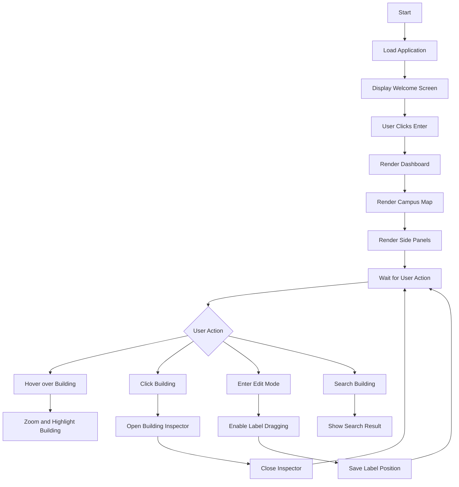
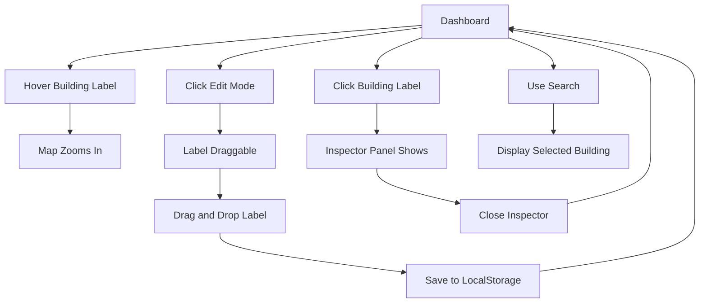
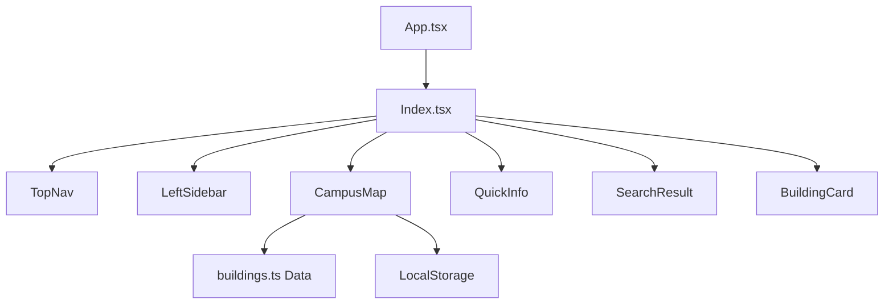

# Project Workflow: Laureate Campus Atlas

## Purpose

This document provides a structured workflow for the project, including development phases, task sequencing, and detailed flowchart instructions for documenting the system.

---

## 1. Project Workflow Overview

The project follows a standard agile-inspired workflow with planning, design, implementation, testing, and deployment stages.

### 1.1 Workflow Stages

1. Requirement Gathering
2. System Design
3. Implementation
4. Testing
5. Deployment
6. Documentation

### 1.2 Deliverables

- Functional campus atlas application
- Project report (`PROJECT_REPORT.md`)
- Workflow and flowchart guide (`PROJECT_WORKFLOW.md`)
- Source code in `src/`
- Screenshots and diagrams for documentation

---

## 2. Detailed Workflow Steps

### 2.1 Requirement Gathering

- Identify target users: students, staff, visitors
- Define use cases:
  - find building locations
  - view building details
  - reposition campus labels
- Collect campus data such as building names, photos, and statistics
- Define scope and out-of-scope items

### 2.2 System Design

- Choose the technology stack: React, TypeScript, Vite, Tailwind CSS, Framer Motion
- Create component architecture:
  - `App.tsx`
  - `Index.tsx`
  - `CampusMap.tsx`
  - `TopNav.tsx`, `LeftSidebar.tsx`, `QuickInfo.tsx`, `SearchResult.tsx`
  - `buildings.ts`
- Design data model and state management strategy
- Plan user flows and interaction patterns

### 2.3 Implementation

- Set up Vite project and install dependencies
- Build the welcome screen and dashboard layout
- Implement the campus map with interactive hotspots
- Add building selection and inspector panel
- Add drag-and-drop label editing and persistence
- Integrate UI components and styling

### 2.4 Testing

- Perform manual UI testing for interactions and responsiveness
- Validate local storage persistence
- Verify route handling and browser compatibility
- Add automated tests where possible using Vitest

### 2.5 Deployment

- Build the project using `npm run build`
- Preview locally with `npm run preview`
- Deploy to a static hosting provider such as Vercel or Netlify

### 2.6 Documentation

- Write the final project report
- Add appendices with file structure and screenshots
- Create flowcharts to explain app behavior

---

## 3. Flowchart Instructions

A flowchart is a visual representation of the system flow and interaction paths. Use the following instructions to create flowcharts for the project:

### 3.1 Flowchart Types

- **High-level system flowchart**: Shows the overall app flow from start to finish
- **User interaction flowchart**: Shows how users move through the app by hovering, clicking, searching, and editing labels
- **Component flowchart**: Shows how the major components connect and which responsibilities each component has

### 3.2 Recommended Flowchart Tools

- draw.io / diagrams.net
- Lucidchart
- Microsoft Visio
- Figma
- Mermaid.js (for Markdown-ready diagrams)

### 3.3 How to Document the Flowchart

1. Define the start point
2. Identify each major component or user interaction
3. Use decision nodes for user choices or conditional branches
4. Connect steps with arrows
5. Label each action clearly
6. Group related processes into sections if needed

---

## 4. Example Flowcharts

### 4.1 High-level App Flow

### 4.2 User Interaction Flow

### 4.3 Component Responsibility Flowchart

---

## 5. Workflow Best Practices

- Start with a clear outline before coding
- Keep each component focused on a single responsibility
- Document every major feature in the report
- Use diagrams to explain design decisions and user flows
- Version control each stage of work in Git

---

## 6. Recommended Workflow Schedule

### Week 1

- Requirement gathering
- Design architecture and wireframes
- Prepare flowchart sketches

### Week 2

- Implement core UI components
- Build campus map interactions
- Add data models and persistence

### Week 3

- Complete inspector panel and search functionality
- Test interactions and responsiveness
- Refine UI design and animations

### Week 4

- Finalize report and workflow documentation
- Generate screenshots and diagrams
- Deploy the project and verify production build

---

## 7. Notes for Report Inclusion

Place the workflow document as a companion reference in the appendices or use it to guide the report sections. Use the flowchart diagrams in the report where you explain system behavior and user interaction.

---

*End of workflow documentation.*
